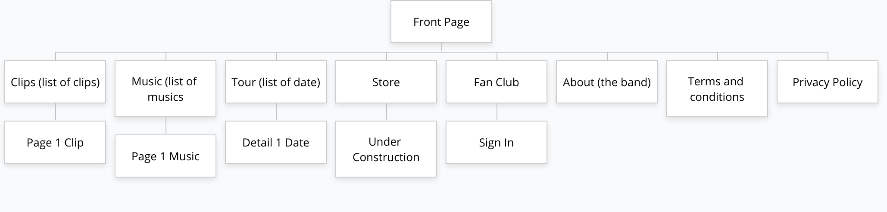

# Le cahier des charges

## Présentation du projet

Site promotionnel d'un groupe de musique à succès.

## Besoins et des objectifs du projet

L'objectif est de créer un site vitrine pour le groupe.
La production d'un store et d'un fan club.
Le visiteur aura aussi accès aux dernières nouvelles du groupe et pourra découvrir ou redécouvrir ce qui a déja été fait, que ce soit:
- pour la musique,
- pour les clips.

Le visiteur pourra aussi s'informer sur les prochaines dates de concerts. 

## MVP (Minimum Viable Product)

- Même Template pour les dernières vidéos, musiques, et date de tournées
- Lien vers le store en construction
- Formulaire Fan Club et newsletters fictifs, pas de vrai inscription
- Design responsive

## Evolutions potentielles

- Template différente pour vidéos, musiques et tournées
- Store (e-commerce)
- Fan Club (abonnement)
- Newsletters (inscriptions)
- Ajout d'un css print media query

## Les fonctionnalités du projet

- Lecteur audio
- Lecteur vidéo
- Commentaires

## Technologies utilisées

- HTML
- CSS
- SCSS
- PHP
- MySQL
- WordPress
- JavaScript
- Figma
- Bootstrap ?

## Public visé

- Fans du groupe
- Amateurs de musique
- Spectateurs de concerts

## Navigateurs compatibles

- Chrome
- Firefox
- Edge

## L'arborescence de l'application

## Templates prévus

- front-page.php: accueil
- page.php: store, about (the band), fanclub, terms and conditions, privacy police
- category.php: 3 catégories (clip, music, tour)
- single-post.php: afficher une publication
- 404.php: page error 404
- search.php: moteur de recherche

## User stories

- Page d'accueil

|En tant que |Je veux |A fin de|
|-|-|-|
|Visiteur |Afficher la page d'accueil|
|Visiteur |Voir les dernières news a la une (musique, vidéo, tournée)|Sans action|
|Visiteur |Effectuer un recherche| Trouver du contenus|
|Visiteur |Accéder à  la catégorie clip| Visionner un clip|
|Visiteur |Accéder à  la catégorie musique| Ecouter un morceau|
|Visiteur |Accéder à  la catégorie tour| Me renseigner sur les prochaines dates|
|Visiteur |Accéder a la liste des résaux |Suivre le groupe sur les résaux|
|Visiteur |S'inscrire a la newsletters |Se tenir au courant|
|Visiteur |S'inscrire au fan club |Avoir accès a des privilèges et soutenir le groupe|
|Visiteur |Accéder au shop |D'acheter des produits dérivés |
|Visiteur |Accéder a la section about (the band) |En savoir plus sur le groupe|
|Visiteur |Accéder a la section privacy policy |En savoir plus sur la politique de confidentialité|
|Visiteur |Accéder a la section terms and conditions |En savoir plus sur les modalités et conditions du site|

- Clip

|En tant que|Je veux|Afin de|
|-|-|-|
|Visiteur |Afficher la page clip|
|Visiteur |Pouvoir voir les derniers clips|Sans action|
|Visiteur |Pouvoir effectuer une recherche|Trouver un clip|
|Visiteur |Pouvoir visionner un clip|Visionner le clip|
|Visiteur |Accéder a la liste des résaux |Suivre le groupe sur les résaux|

- Music

|En tant que|Je veux|Afin de|
|-|-|-|
|Visiteur |Afficher la page musique|
|Visiteur |Pouvoir voir les dernières musiques|Sans action|
|Visiteur |Pouvoir effectuer une recherche|Trouver une musique|
|Visiteur |Pouvoir écouter une musique| Ecouter la musique|
|Visiteur |Accéder a la liste des réseaux |Suivre le groupe sur les réseaux|

- Tour

|En tant que|Je veux|Afin de|
|-|-|-|
|Visiteur |Afficher la page Tour|
|Visiteur |Pouvoir visualiser la liste des dates de concert|Accéder à une description détaillée d'un concert|
|Visiteur |Accéder a la liste des réseaux |Suivre le groupe sur les réseaux|

- Store

|En tant que|Je veux|Afin de|
|-|-|-|
|Visiteur |Afficher la page Store|
|Visiteur |Pouvoir visualiser les derniers arcticles et offres|D'acheter des produits dérivés |
|Visiteur |Accéder a la liste des réseaux |Suivre le groupe sur les réseaux|

- Fanclub

|En tant que|Je veux|Afin de|
|-|-|-|
|Visiteur |Afficher la page Fan Club|
|Visiteur |Pouvoir remplir le formulaire d'abonnement au Fan Club|M'inscrire au Fan Club du groupe|
|Visiteur |Accéder a la liste des réseaux |Suivre le groupe sur les réseaux|

- About (the band)

|En tant que|Je veux|Afin de|
|-|-|-|
|Visiteur |Afficher la page About |D'en savoir plus|
|Visiteur |Accéder a la liste des réseaux |Suivre le groupe sur les réseaux|

- Terms and conditions

|En tant que|Je veux|Afin de|
|-|-|-|
|Visiteur |Afficher la page terms and conditions|Pouvoir voir les modalités et conditions du site|
|Visiteur |Accéder a la liste des réseaux |Suivre le groupe sur les réseaux|

- Privacy Policy

|En tant que|Je veux|Afin de|
|-|-|-|
|Visiteur ||Afficher la page privacy policy|Pouvoir voir la politique de confidentialité|
|Visiteur |Accéder a la liste des réseaux |Suivre le groupe sur les réseaux|

## Roles

- Product Owner: Lorenzo
- Scrum master: Arthur
- Lead dev front & Lead dev back: Hachmi
- Référents techniques: Nasser

